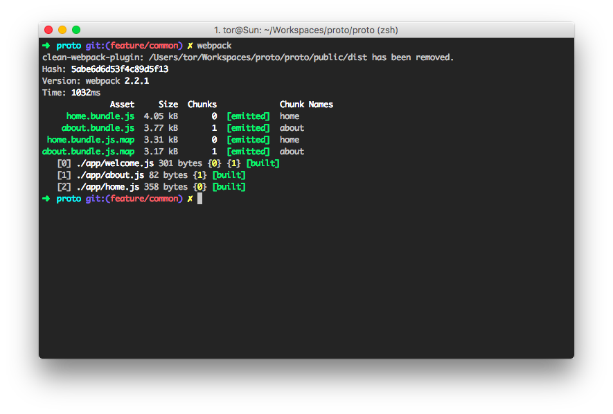
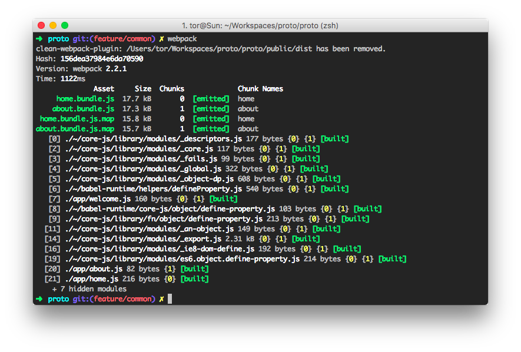

# Proto

## Getting Started

Установить зависимости и запустить сервер
```
git clone https://github.com/0777144/proto && cd proto
npm install
npm run build
npm run server
```

Запустить watcher изменений для разработки
```
npm run watch
```


## Features

* [webpack 2.2.1]
* JavaScript [ES6] syntax


[webpack 2.2.1]: https://github.com/webpack/webpack/tree/v2.2.1
[ES6]: http://es6-features.org/


## Problem/Questions

На сайте [офицальной документации](about.bundle.js) сказано

```
  Babel uses very small helpers for common functions such as _extend. By default this will be added
  to every file that requires it. This duplication is sometimes unnecessary, especially when your
  application is spread out over multiple files.
```

* **Когда и при каких услоавиях `babel` генерирует эти вспомогательные функции**
  * Например, в случае использования [`Computed property names`](https://developer.mozilla.org/ru/docs/Web/JavaScript/Reference/Operators/Object_initializer)
    [Пример из документации babel](https://babeljs.io/docs/plugins/transform-es2015-computed-properties/#example)

Для следующего кода, будет создана функция хелпер `_defineProperty`

```js
{[val]: val}
```

И в результате получится

```js
function _defineProperty(obj, key, value) { if (key in obj) { Object.defineProperty(obj, key, { value: value, enumerable: true, configurable: true, writable: true }); } else { obj[key] = value; } return obj; }
_defineProperty({}, text + '_' + text, text);
```

* **Когда нужно подключать `babel-polyfill` (как я пойму, что мне нужен полифил?)**
  * Посмотреть [ECMAScript 6 compatibility table](https://kangax.github.io/compat-table/es6/) для нужного мне функционала, и если таковой не поддерживается в нужном мне окружении, то уже тогда думаю о подключение полифила, так получается?
  * Вообще [babel-plugin-transform-runtime] подключает нужные полифилы по мере необходимости (когда находит использования в коде)
* **Куда их подключать**
  * [babel-plugin-transform-runtime] может позаботиться об этом
  * А если хочется выделить их в common, то можно попробовать использовать [CommonsChunkPlugin], но там есть некоторые особенности, если, например, `Promise` используется только в одном файле, то к `common` он не попадет...
* **Как объединить нужные мне полифилы и либы в `common`**
  * использовать [CommonsChunkPlugin]
  * можно создать в `webpack.config` точку входа `common` (если еще используется [CommonsChunkPlugin], то нужно чтобы имя точки входа соотвествало имени(`name`) указанному в [CommonsChunkPlugin], тогда туда попадут не только явно указанные в `entry`, но и те которые добавит [CommonsChunkPlugin]) и перечислить там то, что нужно `common: ['react', 'ramda', 'babel-runtime/core-js']`, но тогда туда попадут все полифилы из `babel-runtime`, **а хотелось бы чтобы они добавлялись по мере необходимости (использования в коде)**
  * либо можно создать файл `./app/common.js`, так же добавив его в точку входа `common` (лучше указывать в конце, потому что, если указана [`output.library`](https://webpack.js.org/configuration/output/#output-library), то [экспортироваться будет последнее (_см. внизу под кодом_)](https://webpack.js.org/configuration/entry-context/#entry), соответвенно чтобы получить экспорт именно `./app/common.js`, нужно добавить его в конец списка), получится `common: ['react', 'ramda', 'babel-runtime/core-js', './app/common']`


## Solution/Investigation 🔦

### Избавляемся от дублирования кода

При следующем конфиге `.babelrc` получаем дублирование кода

```json
{
  "presets": [
    [ "es2015", {"modules": false}]
  ],
}
```

(I used `diff` that highlight lines, on the case code didn't have `-` symbols)
<details>
<summary>```/******/ (function(modules) { // webpackBootstrap```</summary>
```js
/******/ (function(modules) { // webpackBootstrap
/******/ 	// The module cache
/******/ 	var installedModules = {};
/******/
/******/ 	// The require function
/******/ 	function __webpack_require__(moduleId) {
/******/
/******/ 		// Check if module is in cache
/******/ 		if(installedModules[moduleId])
/******/ 			return installedModules[moduleId].exports;
/******/
/******/ 		// Create a new module (and put it into the cache)
/******/ 		var module = installedModules[moduleId] = {
/******/ 			i: moduleId,
/******/ 			l: false,
/******/ 			exports: {}
/******/ 		};
/******/
/******/ 		// Execute the module function
/******/ 		modules[moduleId].call(module.exports, module, module.exports, __webpack_require__);
/******/
/******/ 		// Flag the module as loaded
/******/ 		module.l = true;
/******/
/******/ 		// Return the exports of the module
/******/ 		return module.exports;
/******/ 	}
/******/
/******/
/******/ 	// expose the modules object (__webpack_modules__)
/******/ 	__webpack_require__.m = modules;
/******/
/******/ 	// expose the module cache
/******/ 	__webpack_require__.c = installedModules;
/******/
/******/ 	// identity function for calling harmony imports with the correct context
/******/ 	__webpack_require__.i = function(value) { return value; };
/******/
/******/ 	// define getter function for harmony exports
/******/ 	__webpack_require__.d = function(exports, name, getter) {
/******/ 		if(!__webpack_require__.o(exports, name)) {
/******/ 			Object.defineProperty(exports, name, {
/******/ 				configurable: false,
/******/ 				enumerable: true,
/******/ 				get: getter
/******/ 			});
/******/ 		}
/******/ 	};
/******/
/******/ 	// getDefaultExport function for compatibility with non-harmony modules
/******/ 	__webpack_require__.n = function(module) {
/******/ 		var getter = module && module.__esModule ?
/******/ 			function getDefault() { return module['default']; } :
/******/ 			function getModuleExports() { return module; };
/******/ 		__webpack_require__.d(getter, 'a', getter);
/******/ 		return getter;
/******/ 	};
/******/
/******/ 	// Object.prototype.hasOwnProperty.call
/******/ 	__webpack_require__.o = function(object, property) { return Object.prototype.hasOwnProperty.call(object, property); };
/******/
/******/ 	// __webpack_public_path__
/******/ 	__webpack_require__.p = "";
/******/
/******/ 	// Load entry module and return exports
/******/ 	return __webpack_require__(__webpack_require__.s = 2);
/******/ })
/************************************************************************/
```
</details>
```diff
  /******/ ([
  /* 0 */
  /* exports provided: welcome */
  /* exports used: welcome */
  /*!************************!*\
    !*** ./app/welcome.js ***!
    \************************/
  /***/ (function(module, __webpack_exports__, __webpack_require__) {

  "use strict";
  /* harmony export (immutable) */ __webpack_exports__["a"] = welcome;
- function _defineProperty(obj, key, value) { if (key in obj) { Object.defineProperty(obj, key, { value: value, enumerable: true, configurable: true, writable: true }); } else { obj[key] = value; } return obj; }

  function welcome(text) {
      return _defineProperty({}, text + '_' + text, text);
  }

  /***/ }),
  /* 1 */,
  /* 2 */
  /* unknown exports provided */
  /* all exports used */
  /*!*********************!*\
    !*** ./app/home.js ***!
    \*********************/
  /***/ (function(module, __webpack_exports__, __webpack_require__) {

  "use strict";
  Object.defineProperty(__webpack_exports__, "__esModule", { value: true });
  /* harmony import */ var __WEBPACK_IMPORTED_MODULE_0__welcome__ = __webpack_require__(/*! ./welcome */ 0);
- function _defineProperty(obj, key, value) { if (key in obj) { Object.defineProperty(obj, key, { value: value, enumerable: true, configurable: true, writable: true }); } else { obj[key] = value; } return obj; }


  var x = 'x';
  var y = 'y';
  console.log('welcome: ', __webpack_require__.i(__WEBPACK_IMPORTED_MODULE_0__welcome__["a" /* welcome */])('home'), _defineProperty({}, x + '_' + y, '???'));

  /***/ })
  /******/ ]);
  //# sourceMappingURL=home.bundle.js.map
```

Немного почитав документацию `babel`, можно найти плагин который избавит нас от дублирования кода, и вынесет код хелперов в отдельные модули, это [babel-plugin-transform-runtime]. Подключим его.
Для этого, как сказанно в [документации](https://babeljs.io/docs/plugins/transform-runtime/#installation), нужно добавить `babel-plugin-transform-runtime` в зависимости:

```bash
npm install --save-dev babel-plugin-transform-runtime
```

И указать в `.babelrc` `"plugins": ["transform-runtime"]`. После этих манипуляций мой `.babelrc` выглядит так:

```json
{
  "presets": [
    [ "es2015", {"modules": false}]
  ],
  "plugins": [
    "transform-runtime"
  ]
}
```

Небольшое отступление... Как я понял, `babel-runtime` необязательно ставить в `dependency` (_"as a production dependency"_ - как сказано в документации), просто это семантически верно, т.к. именно код из `babel-runtime` попадает в сборку, а вообще `babel-runtime` устанавливается как зависимость для `babel-core` и для `babel-plugin-transform-runtime` соответственно. (да и вообще для всех `babel-*` пакетов (попробуйте `grep -R --include=package.json babel-runtime node_modules`)). А также `babel-runtime` имеет в `devDependency` `babel-plugin-transform-runtime`.


В результате сборки у меня получились такие diff'ы: [about-with-without.diff](builds/about-with-without.diff) и, **наиболее интересный (потому что имеено тут было дублирование кода) [home-with-without.diff](builds/home-with-without.diff)** (можно заметить, что теперь мы избежали дублирования кода, но зато, появился какой-то лишний)

Результаты сборки:
* **without transform runtime**
  
* **with transform runtime**
  

> P.S. подключилось много зависимостей, все они необходимы для правильной (по спецификации) реализации необхдимого функционала.

### Другие возможности сборки (мод `loose`)

За нужное нам преобразование отвечает [`babel-plugin-transform-es2015-computed-properties`](https://babeljs.io/docs/plugins/transform-es2015-computed-properties), подключим только его и убедимся, что результат соответсвует тому, как если бы подключили `babel-preset-es2015` содержащий этот плагин. Тогда `.babelrc` будет выглядеть следующим образом

```json
{
  "plugins": [
    ["transform-es2015-computed-properties"]
  ]
}
```

Как и ожидалось в коде появилось дублирование `_defineProperty`

```js
function _defineProperty(obj, key, value) { if (key in obj) { Object.defineProperty(obj, key, { value: value, enumerable: true, configurable: true, writable: true }); } else { obj[key] = value; } return obj; }
```

Посмотрим как еще можно от этого избавиться...

У этого плагина [`babel-plugin-transform-es2015-computed-properties`](https://babeljs.io/docs/plugins/transform-es2015-computed-properties) есть параметр `loose`, который указывает использовать упрощенный синтаксис, менее соответвующей спецификации ES6 ([можно почитать тут](http://www.2ality.com/2015/12/babel6-loose-mode.html)).

```json
{
  "plugins": [
    ["transform-es2015-computed-properties", {
      "loose": true
    }]
  ]
}
```

**Получаются следующие преобразования:**

Код модуля `welcome` до преобразований

```js
export function welcome(text) {
    return {[text + '_' + text]: text};
}
```

Код модуля `welcome` **без использования** флага `loose`

```js
function _defineProperty(obj, key, value) { if (key in obj) { Object.defineProperty(obj, key, { value: value, enumerable: true, configurable: true, writable: true }); } else { obj[key] = value; } return obj; }

function welcome(text) {
    return _defineProperty({}, text + '_' + text, text);
}
```

Код модуля `welcome` **c использованием** флага `loose`

```js
function welcome(text) {
    var _ref;

    return _ref = {}, _ref[text + '_' + text] = text, _ref;
}
```

Итого, мы избавились от дублирования, код стал проще, но не значит лучше, теперь он не совсем соответсвует спецификации, и это не в нашу пользу, в теории могут какие-то сайд эффекты.

И все же, вот список плагинов поддерживающих `loose`

* [transform-es2015-classes](http://babeljs.io/docs/plugins/transform-es2015-classes)
* [transform-es2015-computed-properties](http://babeljs.io/docs/plugins/transform-es2015-computed-properties)
* [transform-es2015-for-of](http://babeljs.io/docs/plugins/transform-es2015-for-of)
* [transform-es2015-spread](http://babeljs.io/docs/plugins/transform-es2015-spread)
* [transform-es2015-destructuring](http://babeljs.io/docs/plugins/transform-es2015-destructuring)
* [transform-es2015-modules-commonjs](http://babeljs.io/docs/plugins/transform-es2015-modules-commonjs)
* [transform-es2015-modules-systemjs](http://babeljs.io/docs/plugins/transform-es2015-modules-systemjs)
* [transform-es2015-modules-amd](http://babeljs.io/docs/plugins/transform-es2015-modules-amd)
* [transform-es2015-modules-umd](http://babeljs.io/docs/plugins/transform-es2015-modules-umd)


Кстати, при следующей конфигурации `.babelrc` в сборку так же не попадут никакие helper'ы babel, потому необходимые пребразования выполнены с флагом `loose`, а соответвенно helper'ов для них не нужно. Полезная возможность точечно указать к каким плагинам, какие параметры применять.

```json
{
  "presets": [
    [ "es2015", {"modules": false}]
  ],
  "plugins": [
    ["transform-runtime"],
    ["transform-es2015-computed-properties", {
      "loose": true
    }]
  ]
}
```

### Common

Для выделения `common` части сборки воспользуемся [CommonsChunkPlugin]


Добавим в секцию `plugins` нашего webpack.config следующее

```js
plugins: [
    new webpack.optimize.CommonsChunkPlugin({
        name: 'common', // обязательный параметр, имя общего "кусочка" сборки
    })
],
```

`.babelrc`

```json
{
  "presets": [
    "es2015"
  ],
  "plugins": [
    "transform-runtime"
  ]
}
```


<details>
  <summary>**Результаты сборки**</summary>
```
➜  proto git:(feature/common) ✗ webpack --display-modules
Hash: a55082f1ec04026ea098
Version: webpack 2.2.1
Time: 1088ms
               Asset       Size  Chunks             Chunk Names
      home.bundle.js  729 bytes       0  [emitted]  home
     about.bundle.js  403 bytes       1  [emitted]  about
    common.bundle.js    19.8 kB       2  [emitted]  common
  home.bundle.js.map  482 bytes       0  [emitted]  home
 about.bundle.js.map  350 bytes       1  [emitted]  about
common.bundle.js.map    18.6 kB       2  [emitted]  common
   [0] ../~/core-js/library/modules/_descriptors.js 177 bytes {2} [built]
   [1] ./welcome.js 504 bytes {2} [built]
   [2] ../~/core-js/library/modules/_is-object.js 107 bytes {2} [built]
   [3] ../~/babel-runtime/helpers/defineProperty.js 540 bytes {2} [built]
   [4] ../~/core-js/library/modules/_core.js 117 bytes {2} [built]
   [5] ../~/core-js/library/modules/_fails.js 99 bytes {2} [built]
   [6] ../~/core-js/library/modules/_global.js 322 bytes {2} [built]
   [7] ../~/core-js/library/modules/_object-dp.js 608 bytes {2} [built]
   [8] ../~/babel-runtime/core-js/object/define-property.js 103 bytes {2} [built]
   [9] ../~/core-js/library/fn/object/define-property.js 213 bytes {2} [built]
  [10] ../~/core-js/library/modules/_a-function.js 120 bytes {2} [built]
  [11] ../~/core-js/library/modules/_an-object.js 149 bytes {2} [built]
  [12] ../~/core-js/library/modules/_ctx.js 505 bytes {2} [built]
  [13] ../~/core-js/library/modules/_dom-create.js 286 bytes {2} [built]
  [14] ../~/core-js/library/modules/_export.js 2.31 kB {2} [built]
  [15] ../~/core-js/library/modules/_hide.js 288 bytes {2} [built]
  [16] ../~/core-js/library/modules/_ie8-dom-define.js 192 bytes {2} [built]
  [17] ../~/core-js/library/modules/_property-desc.js 183 bytes {2} [built]
  [18] ../~/core-js/library/modules/_to-primitive.js 644 bytes {2} [built]
  [19] ../~/core-js/library/modules/es6.object.define-property.js 214 bytes {2} [built]
  [20] ./about.js 110 bytes {1} [built]
  [21] ./home.js 421 bytes {0} [built]
```
</details>


Как видно из результатов сборки, все сгенерированные  `babel` функции попали в общий кусок сборки, как и задумывалось.

Но если мы, например, начнем использовать промисы, и добавим их только `home.js`

Код модуля home

```diff
  import {welcome} from './welcome';

  let a = 'a';
  let b = 'b';

- console.log('welcome: ', welcome('home'), {[a + b]:'???'});

+ Promise.resolve({[a + b]:'???'});
```

То тогда сами промисы попадут только в модуль home

<details>
  <summary>**Результаты сборки**</summary>
```
➜  proto git:(feature/common) ✗ webpack --display-modules
Hash: 8ba48b9d8e1857b64781
Version: webpack 2.2.1
Time: 991ms
               Asset       Size  Chunks             Chunk Names
      home.bundle.js    51.4 kB       0  [emitted]  home
     about.bundle.js  404 bytes       1  [emitted]  about
    common.bundle.js    20.3 kB       2  [emitted]  common
  home.bundle.js.map    50.1 kB       0  [emitted]  home
 about.bundle.js.map  350 bytes       1  [emitted]  about
common.bundle.js.map    18.7 kB       2  [emitted]  common
   [0] ../~/core-js/library/modules/_wks.js 368 bytes {0} [built]
   [1] ../~/core-js/library/modules/_global.js 322 bytes {2} [built]
   [2] ../~/core-js/library/modules/_an-object.js 149 bytes {2} [built]
   [3] ../~/core-js/library/modules/_core.js 117 bytes {2} [built]
   [4] ../~/core-js/library/modules/_descriptors.js 177 bytes {2} [built]
   [5] ../~/core-js/library/modules/_hide.js 288 bytes {2} [built]
   [6] ../~/core-js/library/modules/_iterators.js 20 bytes {0} [built]
   [7] ../~/core-js/library/modules/_object-dp.js 608 bytes {2} [built]
   [8] ../~/core-js/library/modules/_cof.js 103 bytes {0} [built]
   [9] ../~/core-js/library/modules/_ctx.js 505 bytes {2} [built]
  [10] ../~/core-js/library/modules/_has.js 117 bytes {0} [built]
  [11] ../~/core-js/library/modules/_is-object.js 107 bytes {2} [built]
  [12] ./welcome.js 504 bytes {2} [built]
  [13] ../~/core-js/library/modules/_a-function.js 120 bytes {2} [built]
  [14] ../~/core-js/library/modules/_defined.js 157 bytes {0} [built]
  [15] ../~/core-js/library/modules/_dom-create.js 286 bytes {2} [built]
  [16] ../~/core-js/library/modules/_export.js 2.31 kB {2} [built]
  [17] ../~/core-js/library/modules/_set-to-string-tag.js 253 bytes {0} [built]
  [18] ../~/core-js/library/modules/_shared-key.js 158 bytes {0} [built]
  [19] ../~/core-js/library/modules/_to-integer.js 158 bytes {0} [built]
  [20] ../~/core-js/library/modules/_to-iobject.js 213 bytes {0} [built]
  [21] ../~/babel-runtime/helpers/defineProperty.js 540 bytes {2} [built]
  [22] ../~/core-js/library/modules/_classof.js 709 bytes {0} [built]
  [23] ../~/core-js/library/modules/_enum-bug-keys.js 159 bytes {0} [built]
  [24] ../~/core-js/library/modules/_fails.js 99 bytes {2} [built]
  [25] ../~/core-js/library/modules/_html.js 75 bytes {0} [built]
  [26] ../~/core-js/library/modules/_iter-define.js 2.82 kB {0} [built]
  [27] ../~/core-js/library/modules/_library.js 22 bytes {0} [built]
  [28] ../~/core-js/library/modules/_property-desc.js 183 bytes {2} [built]
  [29] ../~/core-js/library/modules/_shared.js 198 bytes {0} [built]
  [30] ../~/core-js/library/modules/_task.js 2.28 kB {0} [built]
  [31] ../~/core-js/library/modules/_to-length.js 217 bytes {0} [built]
  [32] ../~/core-js/library/modules/_uid.js 158 bytes {0} [built]
  [33] ../~/babel-runtime/core-js/promise.js 88 bytes {0} [built]
  [34] ../~/babel-runtime/core-js/object/define-property.js 103 bytes {2} [built]
  [35] ../~/core-js/library/fn/object/define-property.js 213 bytes {2} [built]
  [36] ../~/core-js/library/fn/promise.js 215 bytes {0} [built]
  [37] ../~/core-js/library/modules/_add-to-unscopables.js 43 bytes {0} [built]
  [38] ../~/core-js/library/modules/_an-instance.js 232 bytes {0} [built]
  [39] ../~/core-js/library/modules/_array-includes.js 788 bytes {0} [built]
  [40] ../~/core-js/library/modules/_for-of.js 1.19 kB {0} [built]
  [41] ../~/core-js/library/modules/_ie8-dom-define.js 192 bytes {2} [built]
  [42] ../~/core-js/library/modules/_invoke.js 709 bytes {0} [built]
  [43] ../~/core-js/library/modules/_iobject.js 236 bytes {0} [built]
  [44] ../~/core-js/library/modules/_is-array-iter.js 277 bytes {0} [built]
  [45] ../~/core-js/library/modules/_iter-call.js 403 bytes {0} [built]
  [46] ../~/core-js/library/modules/_iter-create.js 528 bytes {0} [built]
  [47] ../~/core-js/library/modules/_iter-detect.js 582 bytes {0} [built]
  [48] ../~/core-js/library/modules/_iter-step.js 81 bytes {0} [built]
  [49] ../~/core-js/library/modules/_microtask.js 1.75 kB {0} [built]
  [50] ../~/core-js/library/modules/_object-create.js 1.52 kB {0} [built]
  [51] ../~/core-js/library/modules/_object-dps.js 404 bytes {0} [built]
  [52] ../~/core-js/library/modules/_object-gpo.js 497 bytes {0} [built]
  [53] ../~/core-js/library/modules/_object-keys-internal.js 546 bytes {0} [built]
  [54] ../~/core-js/library/modules/_object-keys.js 225 bytes {0} [built]
  [55] ../~/core-js/library/modules/_redefine-all.js 210 bytes {0} [built]
  [56] ../~/core-js/library/modules/_redefine.js 36 bytes {0} [built]
  [57] ../~/core-js/library/modules/_set-species.js 449 bytes {0} [built]
  [58] ../~/core-js/library/modules/_species-constructor.js 340 bytes {0} [built]
  [59] ../~/core-js/library/modules/_string-at.js 611 bytes {0} [built]
  [60] ../~/core-js/library/modules/_to-index.js 230 bytes {0} [built]
  [61] ../~/core-js/library/modules/_to-object.js 129 bytes {0} [built]
  [62] ../~/core-js/library/modules/_to-primitive.js 644 bytes {2} [built]
  [63] ../~/core-js/library/modules/core.get-iterator-method.js 293 bytes {0} [built]
  [64] ../~/core-js/library/modules/es6.array.iterator.js 1.13 kB {0} [built]
  [65] ../~/core-js/library/modules/es6.object.define-property.js 214 bytes {2} [built]
  [66] ../~/core-js/library/modules/es6.object.to-string.js 0 bytes {0} [built]
  [67] ../~/core-js/library/modules/es6.promise.js 10 kB {0} [built]
  [68] ../~/core-js/library/modules/es6.string.iterator.js 523 bytes {0} [built]
  [69] ../~/core-js/library/modules/web.dom.iterable.js 559 bytes {0} [built]
  [70] ./about.js 110 bytes {1} [built]
  [71] ./home.js 500 bytes {0} [built]
```
</details>


А нам бы хотелось, чтобы модули из `../~/core-js/` или `../~/babel-runtime/` всегда попадали в общую сборку.
Для этого можно попробовать добавить в webpack.config еще одну точку входа
```diff 
     entry: {
         home: './home',
         about: './about',
+        common: [
+            'babel-runtime/core-js'
+        ]
     },
```    


Результаты сборки окажутся не такими как мы ожидали и теперь в common попадут все зависимости из `babel-runtime`, т.е. реализация всех возможностей ES6, в целом, это может быть вполне приемлемым решение, если мы точно знаем хотим использовать их все.

<details>
  <summary>**Результаты сборки**</summary>
```
➜  proto git:(feature/common) webpack --display-modules
clean-webpack-plugin: /Users/tor/Workspaces/proto/proto/public/dist has been removed.
Hash: 89748760d387b1062818
Version: webpack 2.2.1
Time: 2466ms
               Asset       Size  Chunks                    Chunk Names
      home.bundle.js    1.82 kB       0  [emitted]         home
     about.bundle.js  406 bytes       1  [emitted]         about
    common.bundle.js     321 kB       2  [emitted]  [big]  common
  home.bundle.js.map    1.15 kB       0  [emitted]         home
 about.bundle.js.map  350 bytes       1  [emitted]         about
common.bundle.js.map     304 kB       2  [emitted]         common
   [0] ../~/core-js/library/modules/_export.js 2.31 kB {2} [built]
   [1] ../~/core-js/library/modules/_an-object.js 149 bytes {2} [built]
   [2] ../~/core-js/library/modules/_global.js 322 bytes {2} [built]
   [3] ../~/core-js/library/modules/_is-object.js 107 bytes {2} [built]
   [4] ../~/core-js/library/modules/_fails.js 99 bytes {2} [built]
   [5] ../~/core-js/library/modules/_object-dp.js 608 bytes {2} [built]
   [6] ../~/core-js/library/modules/_wks.js 368 bytes {2} [built]
   [7] ../~/core-js/library/modules/_descriptors.js 177 bytes {2} [built]
   [8] ../~/core-js/library/modules/_to-length.js 217 bytes {2} [built]
   [9] ../~/core-js/library/modules/_core.js 117 bytes {2} [built]
  [10] ../~/core-js/library/modules/_to-object.js 129 bytes {2} [built]
  [11] ../~/core-js/library/modules/_to-iobject.js 213 bytes {2} [built]
  [12] ../~/core-js/library/modules/_a-function.js 120 bytes {2} [built]
  [13] ../~/core-js/library/modules/_object-gpo.js 497 bytes {2} [built]
  [14] ../~/core-js/library/modules/_string-html.js 696 bytes {2} [built]
  [15] ../~/core-js/library/modules/_has.js 117 bytes {2} [built]
  [16] ../~/core-js/library/modules/_hide.js 288 bytes {2} [built]
  [17] ../~/core-js/library/modules/_object-gopd.js 607 bytes {2} [built]
  [18] ../~/core-js/library/modules/_array-methods.js 1.56 kB {2} [built]
  [19] ../~/core-js/library/modules/_strict-method.js 187 bytes {2} [built]
  [20] ../~/core-js/library/modules/_cof.js 103 bytes {2} [built]
  [21] ../~/core-js/library/modules/_ctx.js 505 bytes {2} [built]
  [22] ../~/core-js/library/modules/_defined.js 157 bytes {2} [built]
  [23] ../~/core-js/library/modules/_object-sap.js 368 bytes {2} [built]
  [24] ../~/core-js/library/modules/_metadata.js 1.78 kB {2} [built]
  [25] ../~/core-js/library/modules/_typed-array.js 18.8 kB {2} [built]
  [26] ../~/core-js/library/modules/_meta.js 1.55 kB {2} [built]
  [27] ../~/core-js/library/modules/_object-create.js 1.52 kB {2} [built]
  [28] ../~/core-js/library/modules/_object-keys.js 225 bytes {2} [built]
  [29] ../~/core-js/library/modules/_property-desc.js 183 bytes {2} [built]
  [30] ../~/core-js/library/modules/_to-integer.js 158 bytes {2} [built]
  [31] ../~/core-js/library/modules/_to-primitive.js 644 bytes {2} [built]
  [32] ../~/core-js/library/modules/_an-instance.js 232 bytes {2} [built]
  [33] ../~/core-js/library/modules/_for-of.js 1.19 kB {2} [built]
  [34] ../~/core-js/library/modules/_iterators.js 20 bytes {2} [built]
  [35] ../~/core-js/library/modules/_library.js 22 bytes {2} [built]
  [36] ../~/core-js/library/modules/_redefine-all.js 210 bytes {2} [built]
  [37] ../~/core-js/library/modules/_set-species.js 449 bytes {2} [built]
  [38] ../~/core-js/library/modules/_to-index.js 230 bytes {2} [built]
  [39] ../~/core-js/library/modules/_add-to-unscopables.js 43 bytes {2} [built]
  [40] ../~/core-js/library/modules/_classof.js 709 bytes {2} [built]
  [41] ../~/core-js/library/modules/_set-to-string-tag.js 253 bytes {2} [built]
  [42] ../~/core-js/library/modules/_uid.js 158 bytes {2} [built]
  [43] ../~/core-js/library/modules/_iobject.js 236 bytes {2} [built]
  [44] ../~/core-js/library/modules/_object-gopn.js 290 bytes {2} [built]
  [45] ../~/core-js/library/modules/_object-pie.js 36 bytes {2} [built]
  [46] ../~/core-js/library/modules/_string-trim.js 894 bytes {2} [built]
  [47] ../~/core-js/library/modules/core.get-iterator-method.js 293 bytes {2} [built]
  [48] ../~/core-js/library/modules/_array-includes.js 788 bytes {2} [built]
  [49] ../~/core-js/library/modules/_collection.js 2.08 kB {2} [built]
  [50] ../~/core-js/library/modules/_invoke.js 709 bytes {2} [built]
  [51] ../~/core-js/library/modules/_iter-create.js 528 bytes {2} [built]
  [52] ../~/core-js/library/modules/_iter-define.js 2.82 kB {2} [built]
  [53] ../~/core-js/library/modules/_object-forced-pam.js 284 bytes {2} [built]
  [54] ../~/core-js/library/modules/_object-gops.js 41 bytes {2} [built]
  [55] ../~/core-js/library/modules/_shared.js 198 bytes {2} [built]
  [56] ../~/core-js/library/modules/_typed.js 671 bytes {2} [built]
  [57] ./welcome.js 504 bytes {2} [built]
  [58] ../~/core-js/library/modules/_array-fill.js 610 bytes {2} [built]
  [59] ../~/core-js/library/modules/_create-property.js 270 bytes {2} [built]
  [60] ../~/core-js/library/modules/_dom-create.js 286 bytes {2} [built]
  [61] ../~/core-js/library/modules/_enum-bug-keys.js 159 bytes {2} [built]
  [62] ../~/core-js/library/modules/_fails-is-regexp.js 244 bytes {2} [built]
  [63] ../~/core-js/library/modules/_html.js 75 bytes {2} [built]
  [64] ../~/core-js/library/modules/_is-array-iter.js 277 bytes {2} [built]
  [65] ../~/core-js/library/modules/_is-array.js 145 bytes {2} [built]
  [66] ../~/core-js/library/modules/_iter-detect.js 582 bytes {2} [built]
  [67] ../~/core-js/library/modules/_iter-step.js 81 bytes {2} [built]
  [68] ../~/core-js/library/modules/_math-expm1.js 341 bytes {2} [built]
  [69] ../~/core-js/library/modules/_math-sign.js 131 bytes {2} [built]
  [70] ../~/core-js/library/modules/_microtask.js 1.75 kB {2} [built]
  [71] ../~/core-js/library/modules/_object-assign.js 1.16 kB {2} [built]
  [72] ../~/core-js/library/modules/_own-keys.js 418 bytes {2} [built]
  [73] ../~/core-js/library/modules/_partial.js 757 bytes {2} [built]
  [74] ../~/core-js/library/modules/_redefine.js 36 bytes {2} [built]
  [75] ../~/core-js/library/modules/_replacer.js 227 bytes {2} [built]
  [76] ../~/core-js/library/modules/_shared-key.js 158 bytes {2} [built]
  [77] ../~/core-js/library/modules/_species-constructor.js 340 bytes {2} [built]
  [78] ../~/core-js/library/modules/_string-at.js 611 bytes {2} [built]
  [79] ../~/core-js/library/modules/_string-context.js 309 bytes {2} [built]
  [80] ../~/core-js/library/modules/_string-repeat.js 366 bytes {2} [built]
  [81] ../~/core-js/library/modules/_string-ws.js 169 bytes {2} [built]
  [82] ../~/core-js/library/modules/_task.js 2.28 kB {2} [built]
  [83] ../~/core-js/library/modules/_typed-buffer.js 9.59 kB {2} [built]
  [84] ../~/core-js/library/modules/_wks-define.js 439 bytes {2} [built]
  [85] ../~/core-js/library/modules/es6.array.iterator.js 1.13 kB {2} [built]
  [86] ../~/babel-runtime/helpers/defineProperty.js 540 bytes {2} [built]
  [87] ../~/core-js/library/modules/_a-number-value.js 153 bytes {2} [built]
  [88] ../~/core-js/library/modules/_array-copy-within.js 833 bytes {2} [built]
  [89] ../~/core-js/library/modules/_array-from-iterable.js 170 bytes {2} [built]
  [90] ../~/core-js/library/modules/_array-reduce.js 816 bytes {2} [built]
  [91] ../~/core-js/library/modules/_bind.js 855 bytes {2} [built]
  [92] ../~/core-js/library/modules/_collection-strong.js 4.83 kB {2} [built]
  [93] ../~/core-js/library/modules/_collection-to-json.js 313 bytes {2} [built]
  [94] ../~/core-js/library/modules/_collection-weak.js 2.69 kB {2} [built]
  [95] ../~/core-js/library/modules/_ie8-dom-define.js 192 bytes {2} [built]
  [96] ../~/core-js/library/modules/_is-integer.js 206 bytes {2} [built]
  [97] ../~/core-js/library/modules/_is-regexp.js 292 bytes {2} [built]
  [98] ../~/core-js/library/modules/_iter-call.js 403 bytes {2} [built]
  [99] ../~/core-js/library/modules/_keyof.js 307 bytes {2} [built]
 [100] ../~/core-js/library/modules/_math-log1p.js 152 bytes {2} [built]
 [101] ../~/core-js/library/modules/_object-define.js 388 bytes {2} [built]
 [102] ../~/core-js/library/modules/_object-dps.js 404 bytes {2} [built]
 [103] ../~/core-js/library/modules/_object-gopn-ext.js 603 bytes {2} [built]
 [104] ../~/core-js/library/modules/_object-keys-internal.js 546 bytes {2} [built]
 [105] ../~/core-js/library/modules/_object-to-array.js 469 bytes {2} [built]
 [106] ../~/core-js/library/modules/_parse-float.js 361 bytes {2} [built]
 [107] ../~/core-js/library/modules/_parse-int.js 403 bytes {2} [built]
 [108] ../~/core-js/library/modules/_path.js 36 bytes {2} [built]
 [109] ../~/core-js/library/modules/_same-value.js 142 bytes {2} [built]
 [110] ../~/core-js/library/modules/_set-proto.js 893 bytes {2} [built]
 [111] ../~/core-js/library/modules/_string-pad.js 751 bytes {2} [built]
 [112] ../~/core-js/library/modules/_wks-ext.js 30 bytes {2} [built]
 [113] ../~/core-js/library/modules/core.is-iterable.js 317 bytes {2} [built]
 [114] ../~/core-js/library/modules/es6.map.js 541 bytes {2} [built]
 [115] ../~/core-js/library/modules/es6.object.define-property.js 214 bytes {2} [built]
 [116] ../~/core-js/library/modules/es6.object.to-string.js 0 bytes {2} [built]
 [117] ../~/core-js/library/modules/es6.promise.js 10 kB {2} [built]
 [118] ../~/core-js/library/modules/es6.set.js 396 bytes {2} [built]
 [119] ../~/core-js/library/modules/es6.string.iterator.js 523 bytes {2} [built]
 [120] ../~/core-js/library/modules/es6.weak-map.js 1.8 kB {2} [built]
 [121] ../~/core-js/library/modules/web.dom.iterable.js 559 bytes {2} [built]
 [122] ../~/babel-runtime/core-js.js 82 bytes {2} [built]
 [123] ../~/babel-runtime/core-js/promise.js 88 bytes {0} [built]
 [124] ../~/babel-runtime/core-js/object/define-property.js 103 bytes {2} [built]
 [125] ../~/core-js/library/fn/object/define-property.js 213 bytes {2} [built]
 [126] ../~/core-js/library/fn/promise.js 215 bytes {0} [built]
 [127] ../~/core-js/library/index.js 639 bytes {2} [built]
 [128] ../~/core-js/library/modules/_array-species-constructor.js 464 bytes {2} [built]
 [129] ../~/core-js/library/modules/_array-species-create.js 220 bytes {2} [built]
 [130] ../~/core-js/library/modules/_enum-keys.js 472 bytes {2} [built]
 [131] ../~/core-js/library/modules/_flags.js 375 bytes {2} [built]
 [132] ../~/core-js/library/modules/core.delay.js 403 bytes {2} [built]
 [133] ../~/core-js/library/modules/core.dict.js 4.51 kB {2} [built]
 [134] ../~/core-js/library/modules/core.function.part.js 206 bytes {2} [built]
 [135] ../~/core-js/library/modules/core.get-iterator.js 295 bytes {2} [built]
 [136] ../~/core-js/library/modules/core.number.iterator.js 238 bytes {2} [built]
 [137] ../~/core-js/library/modules/core.object.classof.js 112 bytes {2} [built]
 [138] ../~/core-js/library/modules/core.object.define.js 138 bytes {2} [built]
 [139] ../~/core-js/library/modules/core.object.is-object.js 115 bytes {2} [built]
 [140] ../~/core-js/library/modules/core.object.make.js 244 bytes {2} [built]
 [141] ../~/core-js/library/modules/core.regexp.escape.js 232 bytes {2} [built]
 [142] ../~/core-js/library/modules/core.string.escape-html.js 280 bytes {2} [built]
 [143] ../~/core-js/library/modules/core.string.unescape-html.js 308 bytes {2} [built]
 [144] ../~/core-js/library/modules/es6.array.copy-within.js 234 bytes {2} [built]
 [145] ../~/core-js/library/modules/es6.array.every.js 368 bytes {2} [built]
 [146] ../~/core-js/library/modules/es6.array.fill.js 212 bytes {2} [built]
 [147] ../~/core-js/library/modules/es6.array.filter.js 373 bytes {2} [built]
 [148] ../~/core-js/library/modules/es6.array.find-index.js 543 bytes {2} [built]
 [149] ../~/core-js/library/modules/es6.array.find.js 523 bytes {2} [built]
 [150] ../~/core-js/library/modules/es6.array.for-each.js 403 bytes {2} [built]
 [151] ../~/core-js/library/modules/es6.array.from.js 1.67 kB {2} [built]
 [152] ../~/core-js/library/modules/es6.array.index-of.js 605 bytes {2} [built]
 [153] ../~/core-js/library/modules/es6.array.is-array.js 142 bytes {2} [built]
 [154] ../~/core-js/library/modules/es6.array.join.js 451 bytes {2} [built]
 [155] ../~/core-js/library/modules/es6.array.last-index-of.js 973 bytes {2} [built]
 [156] ../~/core-js/library/modules/es6.array.map.js 359 bytes {2} [built]
 [157] ../~/core-js/library/modules/es6.array.of.js 599 bytes {2} [built]
 [158] ../~/core-js/library/modules/es6.array.reduce-right.js 424 bytes {2} [built]
 [159] ../~/core-js/library/modules/es6.array.reduce.js 405 bytes {2} [built]
 [160] ../~/core-js/library/modules/es6.array.slice.js 909 bytes {2} [built]
 [161] ../~/core-js/library/modules/es6.array.some.js 364 bytes {2} [built]
 [162] ../~/core-js/library/modules/es6.array.sort.js 648 bytes {2} [built]
 [163] ../~/core-js/library/modules/es6.array.species.js 35 bytes {2} [built]
 [164] ../~/core-js/library/modules/es6.date.now.js 149 bytes {2} [built]
 [165] ../~/core-js/library/modules/es6.date.to-iso-string.js 1.01 kB {2} [built]
 [166] ../~/core-js/library/modules/es6.date.to-json.js 510 bytes {2} [built]
 [167] ../~/core-js/library/modules/es6.date.to-primitive.js 0 bytes {2} [built]
 [168] ../~/core-js/library/modules/es6.date.to-string.js 0 bytes {2} [built]
 [169] ../~/core-js/library/modules/es6.function.bind.js 161 bytes {2} [built]
 [170] ../~/core-js/library/modules/es6.function.has-instance.js 655 bytes {2} [built]
 [171] ../~/core-js/library/modules/es6.function.name.js 0 bytes {2} [built]
 [172] ../~/core-js/library/modules/es6.math.acosh.js 573 bytes {2} [built]
 [173] ../~/core-js/library/modules/es6.math.asinh.js 339 bytes {2} [built]
 [174] ../~/core-js/library/modules/es6.math.atanh.js 303 bytes {2} [built]
 [175] ../~/core-js/library/modules/es6.math.cbrt.js 218 bytes {2} [built]
 [176] ../~/core-js/library/modules/es6.math.clz32.js 206 bytes {2} [built]
 [177] ../~/core-js/library/modules/es6.math.cosh.js 188 bytes {2} [built]
 [178] ../~/core-js/library/modules/es6.math.expm1.js 184 bytes {2} [built]
 [179] ../~/core-js/library/modules/es6.math.fround.js 743 bytes {2} [built]
 [180] ../~/core-js/library/modules/es6.math.hypot.js 660 bytes {2} [built]
 [181] ../~/core-js/library/modules/es6.math.imul.js 532 bytes {2} [built]
 [182] ../~/core-js/library/modules/es6.math.log10.js 164 bytes {2} [built]
 [183] ../~/core-js/library/modules/es6.math.log1p.js 126 bytes {2} [built]
 [184] ../~/core-js/library/modules/es6.math.log2.js 160 bytes {2} [built]
 [185] ../~/core-js/library/modules/es6.math.sign.js 123 bytes {2} [built]
 [186] ../~/core-js/library/modules/es6.math.sinh.js 454 bytes {2} [built]
 [187] ../~/core-js/library/modules/es6.math.tanh.js 318 bytes {2} [built]
 [188] ../~/core-js/library/modules/es6.math.trunc.js 179 bytes {2} [built]
 [189] ../~/core-js/library/modules/es6.number.constructor.js 0 bytes {2} [built]
 [190] ../~/core-js/library/modules/es6.number.epsilon.js 122 bytes {2} [built]
 [191] ../~/core-js/library/modules/es6.number.is-finite.js 245 bytes {2} [built]
 [192] ../~/core-js/library/modules/es6.number.is-integer.js 142 bytes {2} [built]
 [193] ../~/core-js/library/modules/es6.number.is-nan.js 170 bytes {2} [built]
 [194] ../~/core-js/library/modules/es6.number.is-safe-integer.js 298 bytes {2} [built]
 [195] ../~/core-js/library/modules/es6.number.max-safe-integer.js 140 bytes {2} [built]
 [196] ../~/core-js/library/modules/es6.number.min-safe-integer.js 142 bytes {2} [built]
 [197] ../~/core-js/library/modules/es6.number.parse-float.js 228 bytes {2} [built]
 [198] ../~/core-js/library/modules/es6.number.parse-int.js 219 bytes {2} [built]
 [199] ../~/core-js/library/modules/es6.number.to-fixed.js 2.71 kB {2} [built]
 [200] ../~/core-js/library/modules/es6.number.to-precision.js 615 bytes {2} [built]
 [201] ../~/core-js/library/modules/es6.object.assign.js 159 bytes {2} [built]
 [202] ../~/core-js/library/modules/es6.object.create.js 158 bytes {2} [built]
 [203] ../~/core-js/library/modules/es6.object.define-properties.js 214 bytes {2} [built]
 [204] ../~/core-js/library/modules/es6.object.freeze.js 266 bytes {2} [built]
 [205] ../~/core-js/library/modules/es6.object.get-own-property-descriptor.js 353 bytes {2} [built]
 [206] ../~/core-js/library/modules/es6.object.get-own-property-names.js 147 bytes {2} [built]
 [207] ../~/core-js/library/modules/es6.object.get-prototype-of.js 275 bytes {2} [built]
 [208] ../~/core-js/library/modules/es6.object.is-extensible.js 263 bytes {2} [built]
 [209] ../~/core-js/library/modules/es6.object.is-frozen.js 239 bytes {2} [built]
 [210] ../~/core-js/library/modules/es6.object.is-sealed.js 239 bytes {2} [built]
 [211] ../~/core-js/library/modules/es6.object.is.js 136 bytes {2} [built]
 [212] ../~/core-js/library/modules/es6.object.keys.js 223 bytes {2} [built]
 [213] ../~/core-js/library/modules/es6.object.prevent-extensions.js 333 bytes {2} [built]
 [214] ../~/core-js/library/modules/es6.object.seal.js 255 bytes {2} [built]
 [215] ../~/core-js/library/modules/es6.object.set-prototype-of.js 157 bytes {2} [built]
 [216] ../~/core-js/library/modules/es6.parse-float.js 201 bytes {2} [built]
 [217] ../~/core-js/library/modules/es6.parse-int.js 192 bytes {2} [built]
 [218] ../~/core-js/library/modules/es6.reflect.apply.js 640 bytes {2} [built]
 [219] ../~/core-js/library/modules/es6.reflect.construct.js 1.95 kB {2} [built]
 [220] ../~/core-js/library/modules/es6.reflect.define-property.js 763 bytes {2} [built]
 [221] ../~/core-js/library/modules/es6.reflect.delete-property.js 405 bytes {2} [built]
 [222] ../~/core-js/library/modules/es6.reflect.enumerate.js 732 bytes {2} [built]
 [223] ../~/core-js/library/modules/es6.reflect.get-own-property-descriptor.js 355 bytes {2} [built]
 [224] ../~/core-js/library/modules/es6.reflect.get-prototype-of.js 287 bytes {2} [built]
 [225] ../~/core-js/library/modules/es6.reflect.get.js 811 bytes {2} [built]
 [226] ../~/core-js/library/modules/es6.reflect.has.js 195 bytes {2} [built]
 [227] ../~/core-js/library/modules/es6.reflect.is-extensible.js 332 bytes {2} [built]
 [228] ../~/core-js/library/modules/es6.reflect.own-keys.js 137 bytes {2} [built]
 [229] ../~/core-js/library/modules/es6.reflect.prevent-extensions.js 437 bytes {2} [built]
 [230] ../~/core-js/library/modules/es6.reflect.set-prototype-of.js 376 bytes {2} [built]
 [231] ../~/core-js/library/modules/es6.reflect.set.js 1.19 kB {2} [built]
 [232] ../~/core-js/library/modules/es6.regexp.constructor.js 36 bytes {2} [built]
 [233] ../~/core-js/library/modules/es6.regexp.flags.js 0 bytes {2} [built]
 [234] ../~/core-js/library/modules/es6.regexp.match.js 0 bytes {2} [built]
 [235] ../~/core-js/library/modules/es6.regexp.replace.js 0 bytes {2} [built]
 [236] ../~/core-js/library/modules/es6.regexp.search.js 0 bytes {2} [built]
 [237] ../~/core-js/library/modules/es6.regexp.split.js 0 bytes {2} [built]
 [238] ../~/core-js/library/modules/es6.regexp.to-string.js 0 bytes {2} [built]
 [239] ../~/core-js/library/modules/es6.string.anchor.js 200 bytes {2} [built]
 [240] ../~/core-js/library/modules/es6.string.big.js 179 bytes {2} [built]
 [241] ../~/core-js/library/modules/es6.string.blink.js 187 bytes {2} [built]
 [242] ../~/core-js/library/modules/es6.string.bold.js 180 bytes {2} [built]
 [243] ../~/core-js/library/modules/es6.string.code-point-at.js 250 bytes {2} [built]
 [244] ../~/core-js/library/modules/es6.string.ends-with.js 840 bytes {2} [built]
 [245] ../~/core-js/library/modules/es6.string.fixed.js 184 bytes {2} [built]
 [246] ../~/core-js/library/modules/es6.string.fontcolor.js 216 bytes {2} [built]
 [247] ../~/core-js/library/modules/es6.string.fontsize.js 209 bytes {2} [built]
 [248] ../~/core-js/library/modules/es6.string.from-code-point.js 848 bytes {2} [built]
 [249] ../~/core-js/library/modules/es6.string.includes.js 476 bytes {2} [built]
 [250] ../~/core-js/library/modules/es6.string.italics.js 189 bytes {2} [built]
 [251] ../~/core-js/library/modules/es6.string.link.js 192 bytes {2} [built]
 [252] ../~/core-js/library/modules/es6.string.raw.js 516 bytes {2} [built]
 [253] ../~/core-js/library/modules/es6.string.repeat.js 155 bytes {2} [built]
 [254] ../~/core-js/library/modules/es6.string.small.js 188 bytes {2} [built]
 [255] ../~/core-js/library/modules/es6.string.starts-with.js 767 bytes {2} [built]
 [256] ../~/core-js/library/modules/es6.string.strike.js 192 bytes {2} [built]
 [257] ../~/core-js/library/modules/es6.string.sub.js 180 bytes {2} [built]
 [258] ../~/core-js/library/modules/es6.string.sup.js 180 bytes {2} [built]
 [259] ../~/core-js/library/modules/es6.string.trim.js 163 bytes {2} [built]
 [260] ../~/core-js/library/modules/es6.symbol.js 8.93 kB {2} [built]
 [261] ../~/core-js/library/modules/es6.typed.array-buffer.js 1.8 kB {2} [built]
 [262] ../~/core-js/library/modules/es6.typed.data-view.js 159 bytes {2} [built]
 [263] ../~/core-js/library/modules/es6.typed.float32-array.js 171 bytes {2} [built]
 [264] ../~/core-js/library/modules/es6.typed.float64-array.js 171 bytes {2} [built]
 [265] ../~/core-js/library/modules/es6.typed.int16-array.js 167 bytes {2} [built]
 [266] ../~/core-js/library/modules/es6.typed.int32-array.js 167 bytes {2} [built]
 [267] ../~/core-js/library/modules/es6.typed.int8-array.js 165 bytes {2} [built]
 [268] ../~/core-js/library/modules/es6.typed.uint16-array.js 169 bytes {2} [built]
 [269] ../~/core-js/library/modules/es6.typed.uint32-array.js 169 bytes {2} [built]
 [270] ../~/core-js/library/modules/es6.typed.uint8-array.js 167 bytes {2} [built]
 [271] ../~/core-js/library/modules/es6.typed.uint8-clamped-array.js 180 bytes {2} [built]
 [272] ../~/core-js/library/modules/es6.weak-set.js 373 bytes {2} [built]
 [273] ../~/core-js/library/modules/es7.array.includes.js 377 bytes {2} [built]
 [274] ../~/core-js/library/modules/es7.asap.js 444 bytes {2} [built]
 [275] ../~/core-js/library/modules/es7.error.is-error.js 218 bytes {2} [built]
 [276] ../~/core-js/library/modules/es7.map.to-json.js 186 bytes {2} [built]
 [277] ../~/core-js/library/modules/es7.math.iaddh.js 335 bytes {2} [built]
 [278] ../~/core-js/library/modules/es7.math.imulh.js 436 bytes {2} [built]
 [279] ../~/core-js/library/modules/es7.math.isubh.js 334 bytes {2} [built]
 [280] ../~/core-js/library/modules/es7.math.umulh.js 440 bytes {2} [built]
 [281] ../~/core-js/library/modules/es7.object.define-getter.js 519 bytes {2} [built]
 [282] ../~/core-js/library/modules/es7.object.define-setter.js 519 bytes {2} [built]
 [283] ../~/core-js/library/modules/es7.object.entries.js 243 bytes {2} [built]
 [284] ../~/core-js/library/modules/es7.object.get-own-property-descriptors.js 659 bytes {2} [built]
 [285] ../~/core-js/library/modules/es7.object.lookup-getter.js 669 bytes {2} [built]
 [286] ../~/core-js/library/modules/es7.object.lookup-setter.js 669 bytes {2} [built]
 [287] ../~/core-js/library/modules/es7.object.values.js 239 bytes {2} [built]
 [288] ../~/core-js/library/modules/es7.observable.js 5.45 kB {2} [built]
 [289] ../~/core-js/library/modules/es7.reflect.define-metadata.js 406 bytes {2} [built]
 [290] ../~/core-js/library/modules/es7.reflect.delete-metadata.js 750 bytes {2} [built]
 [291] ../~/core-js/library/modules/es7.reflect.get-metadata-keys.js 861 bytes {2} [built]
 [292] ../~/core-js/library/modules/es7.reflect.get-metadata.js 796 bytes {2} [built]
 [293] ../~/core-js/library/modules/es7.reflect.get-own-metadata-keys.js 400 bytes {2} [built]
 [294] ../~/core-js/library/modules/es7.reflect.get-own-metadata.js 417 bytes {2} [built]
 [295] ../~/core-js/library/modules/es7.reflect.has-metadata.js 713 bytes {2} [built]
 [296] ../~/core-js/library/modules/es7.reflect.has-own-metadata.js 417 bytes {2} [built]
 [297] ../~/core-js/library/modules/es7.reflect.metadata.js 551 bytes {2} [built]
 [298] ../~/core-js/library/modules/es7.set.to-json.js 186 bytes {2} [built]
 [299] ../~/core-js/library/modules/es7.string.at.js 240 bytes {2} [built]
 [300] ../~/core-js/library/modules/es7.string.match-all.js 1.04 kB {2} [built]
 [301] ../~/core-js/library/modules/es7.string.pad-end.js 337 bytes {2} [built]
 [302] ../~/core-js/library/modules/es7.string.pad-start.js 340 bytes {2} [built]
 [303] ../~/core-js/library/modules/es7.string.trim-left.js 215 bytes {2} [built]
 [304] ../~/core-js/library/modules/es7.string.trim-right.js 215 bytes {2} [built]
 [305] ../~/core-js/library/modules/es7.symbol.async-iterator.js 42 bytes {2} [built]
 [306] ../~/core-js/library/modules/es7.symbol.observable.js 39 bytes {2} [built]
 [307] ../~/core-js/library/modules/es7.system.global.js 143 bytes {2} [built]
 [308] ../~/core-js/library/modules/web.immediate.js 164 bytes {2} [built]
 [309] ../~/core-js/library/modules/web.timers.js 702 bytes {2} [built]
 [310] ../~/core-js/library/shim.js 7.38 kB {2} [built]
 [311] ./about.js 110 bytes {1} [built]
 [312] ./home.js 500 bytes {0} [built]
 [313] multi babel-runtime/core-js 28 bytes {2} [built]
```
</details>


## Как подключать полифилы по мере необходимости и чтобы они всегда попадали в общую сборку


Для решения этой проблемы добавим файл `./app/common.js`
и подключим там необходимый полифил

```js
require('babel-runtime/core-js/promise');
```

а так же в webpack.config укажем в точке входа `./common`

```js
entry: {
    home: './home',
    about: './about',
    common: [
        // other libs
        './common'
    ]
},
```

> P.S. Указали `./common` последним потому, что если мы зохотим что-то экспортировать из него в глобальное пространство (`output.library`), то он должнен быть в конце, т.к webpack, [если переда массив будет экспортировать только экспорты последнего модуля](https://webpack.js.org/configuration/entry-context/#entry)


<details>
  <summary>**Результаты сборки**</summary>
```
➜  proto git:(feature/common) ✗ webpack --display-modules
Hash: 9ea74a39cd792f8caf1f
Version: webpack 2.2.1
Time: 1016ms
               Asset       Size  Chunks             Chunk Names
      home.bundle.js  937 bytes       0  [emitted]  home
     about.bundle.js  404 bytes       1  [emitted]  about
    common.bundle.js    70.9 kB       2  [emitted]  common
  home.bundle.js.map  583 bytes       0  [emitted]  home
 about.bundle.js.map  350 bytes       1  [emitted]  about
common.bundle.js.map    68.6 kB       2  [emitted]  common
   [0] ../~/core-js/library/modules/_wks.js 368 bytes {2} [built]
   [1] ../~/core-js/library/modules/_global.js 322 bytes {2} [built]
   [2] ../~/core-js/library/modules/_an-object.js 149 bytes {2} [built]
   [3] ../~/core-js/library/modules/_core.js 117 bytes {2} [built]
   [4] ../~/core-js/library/modules/_descriptors.js 177 bytes {2} [built]
   [5] ../~/core-js/library/modules/_hide.js 288 bytes {2} [built]
   [6] ../~/core-js/library/modules/_iterators.js 20 bytes {2} [built]
   [7] ../~/core-js/library/modules/_object-dp.js 608 bytes {2} [built]
   [8] ../~/core-js/library/modules/_cof.js 103 bytes {2} [built]
   [9] ../~/core-js/library/modules/_ctx.js 505 bytes {2} [built]
  [10] ../~/core-js/library/modules/_has.js 117 bytes {2} [built]
  [11] ../~/core-js/library/modules/_is-object.js 107 bytes {2} [built]
  [12] ./welcome.js 504 bytes {2} [built]
  [13] ../~/core-js/library/modules/_a-function.js 120 bytes {2} [built]
  [14] ../~/core-js/library/modules/_defined.js 157 bytes {2} [built]
  [15] ../~/core-js/library/modules/_dom-create.js 286 bytes {2} [built]
  [16] ../~/core-js/library/modules/_export.js 2.31 kB {2} [built]
  [17] ../~/core-js/library/modules/_set-to-string-tag.js 253 bytes {2} [built]
  [18] ../~/core-js/library/modules/_shared-key.js 158 bytes {2} [built]
  [19] ../~/core-js/library/modules/_to-integer.js 158 bytes {2} [built]
  [20] ../~/core-js/library/modules/_to-iobject.js 213 bytes {2} [built]
  [21] ../~/babel-runtime/core-js/promise.js 88 bytes {2} [built]
  [22] ../~/babel-runtime/helpers/defineProperty.js 540 bytes {2} [built]
  [23] ../~/core-js/library/modules/_classof.js 709 bytes {2} [built]
  [24] ../~/core-js/library/modules/_enum-bug-keys.js 159 bytes {2} [built]
  [25] ../~/core-js/library/modules/_fails.js 99 bytes {2} [built]
  [26] ../~/core-js/library/modules/_html.js 75 bytes {2} [built]
  [27] ../~/core-js/library/modules/_iter-define.js 2.82 kB {2} [built]
  [28] ../~/core-js/library/modules/_library.js 22 bytes {2} [built]
  [29] ../~/core-js/library/modules/_property-desc.js 183 bytes {2} [built]
  [30] ../~/core-js/library/modules/_shared.js 198 bytes {2} [built]
  [31] ../~/core-js/library/modules/_task.js 2.28 kB {2} [built]
  [32] ../~/core-js/library/modules/_to-length.js 217 bytes {2} [built]
  [33] ../~/core-js/library/modules/_uid.js 158 bytes {2} [built]
  [34] ./common.js 56 bytes {2} [built]
  [35] ../~/babel-runtime/core-js/object/define-property.js 103 bytes {2} [built]
  [36] ../~/core-js/library/fn/object/define-property.js 213 bytes {2} [built]
  [37] ../~/core-js/library/fn/promise.js 215 bytes {2} [built]
  [38] ../~/core-js/library/modules/_add-to-unscopables.js 43 bytes {2} [built]
  [39] ../~/core-js/library/modules/_an-instance.js 232 bytes {2} [built]
  [40] ../~/core-js/library/modules/_array-includes.js 788 bytes {2} [built]
  [41] ../~/core-js/library/modules/_for-of.js 1.19 kB {2} [built]
  [42] ../~/core-js/library/modules/_ie8-dom-define.js 192 bytes {2} [built]
  [43] ../~/core-js/library/modules/_invoke.js 709 bytes {2} [built]
  [44] ../~/core-js/library/modules/_iobject.js 236 bytes {2} [built]
  [45] ../~/core-js/library/modules/_is-array-iter.js 277 bytes {2} [built]
  [46] ../~/core-js/library/modules/_iter-call.js 403 bytes {2} [built]
  [47] ../~/core-js/library/modules/_iter-create.js 528 bytes {2} [built]
  [48] ../~/core-js/library/modules/_iter-detect.js 582 bytes {2} [built]
  [49] ../~/core-js/library/modules/_iter-step.js 81 bytes {2} [built]
  [50] ../~/core-js/library/modules/_microtask.js 1.75 kB {2} [built]
  [51] ../~/core-js/library/modules/_object-create.js 1.52 kB {2} [built]
  [52] ../~/core-js/library/modules/_object-dps.js 404 bytes {2} [built]
  [53] ../~/core-js/library/modules/_object-gpo.js 497 bytes {2} [built]
  [54] ../~/core-js/library/modules/_object-keys-internal.js 546 bytes {2} [built]
  [55] ../~/core-js/library/modules/_object-keys.js 225 bytes {2} [built]
  [56] ../~/core-js/library/modules/_redefine-all.js 210 bytes {2} [built]
  [57] ../~/core-js/library/modules/_redefine.js 36 bytes {2} [built]
  [58] ../~/core-js/library/modules/_set-species.js 449 bytes {2} [built]
  [59] ../~/core-js/library/modules/_species-constructor.js 340 bytes {2} [built]
  [60] ../~/core-js/library/modules/_string-at.js 611 bytes {2} [built]
  [61] ../~/core-js/library/modules/_to-index.js 230 bytes {2} [built]
  [62] ../~/core-js/library/modules/_to-object.js 129 bytes {2} [built]
  [63] ../~/core-js/library/modules/_to-primitive.js 644 bytes {2} [built]
  [64] ../~/core-js/library/modules/core.get-iterator-method.js 293 bytes {2} [built]
  [65] ../~/core-js/library/modules/es6.array.iterator.js 1.13 kB {2} [built]
  [66] ../~/core-js/library/modules/es6.object.define-property.js 214 bytes {2} [built]
  [67] ../~/core-js/library/modules/es6.object.to-string.js 0 bytes {2} [built]
  [68] ../~/core-js/library/modules/es6.promise.js 10 kB {2} [built]
  [69] ../~/core-js/library/modules/es6.string.iterator.js 523 bytes {2} [built]
  [70] ../~/core-js/library/modules/web.dom.iterable.js 559 bytes {2} [built]
  [71] ./about.js 110 bytes {1} [built]
  [72] ./home.js 607 bytes {0} [built]
  [73] multi ./common 28 bytes {2} [built]
```
</details>

Теперь в сборку попали только промисы, и они находятся в `common`, как и задумывалось

Либо если мы точно хотим использовать все возможности ES6 то можно указать в webpack.config

```js
entry: {
    home: './home',
    about: './about',
    // simple: './simple',
    common: [
        'babel-runtime/core-js',
        // other libs...
    ]
},
```

тогда не нужно создавать файл `./app/common.js` и указывать в точке входа

[babel-plugin-transform-runtime]: https://github.com/babel/babel/tree/master/packages/babel-plugin-transform-runtime
[CommonsChunkPlugin]: https://webpack.js.org/plugins/commons-chunk-plugin/
