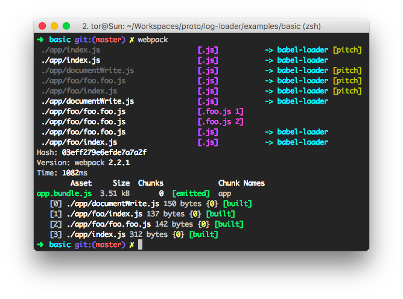

# Proto

## Getting Started

Установить зависимости и запустить сервер
```
git clone https://github.com/0777144/proto && cd proto
git checkout feature/log-loader
npm install
npm run build
npm run server
```

Запустить watcher изменений для разработки
```
npm run watch
```


## Features

* [webpack 2.2.1]
* JavaScript [ES6] syntax


[webpack 2.2.1]: https://github.com/webpack/webpack/tree/v2.2.1
[ES6]: http://es6-features.org/


## Выводы

Конфиг webpack'а

```js
// ...
module.exports = {
    // ...
    module: {
        rules: [
            {
                test: /\.js$/,
                // ...
                use: [
                    'log-loader?id=.js'
                ]
            },
            {
                test: /\.test\.js$/,
                // ...
                use: [
                    'log-loader?id=.foo.js 2', // // will be runned second
                    'log-loader?id=.foo.js 1'  // will be runned first
                ]
            }
        ]
    }
}
```

Из этого примера можем убедистя что лоадеры запускаются в обратном порядке, а так же заметить, что
если файл попадает под неколько правил, то они будут применяться снизу веерх (так же как и лоадеры)


